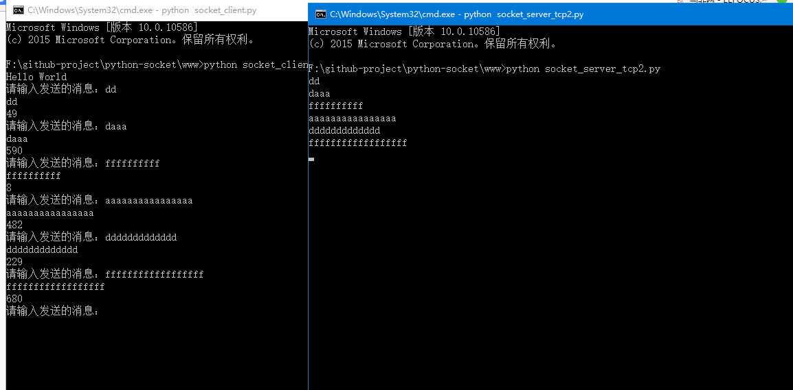

<h1 align="center" style="margin-bottom: 20px;">python中socket 通信实例</h1>

<code>版本号:1.0</code>

作者: [雷小天博客](https://www.100txy.com)

项目: python-socket

# 项目说明
socket_server.py和socket_client.py为TCP方式的。socket_server_udp.py和socket_client_udp.py为udp方式；socket_server_tcp2.py和socket_client.py是导入了import socketserver

# 资源文件
jQuery压缩库  uikit这个强大的CSS框架

## 赞助
https://www.100txy.com/Home/Index/alidonate.html

## 导入socketserver

